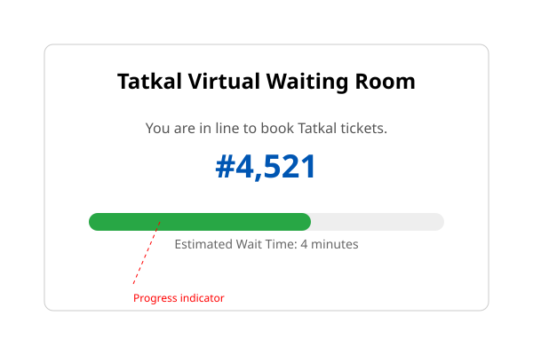
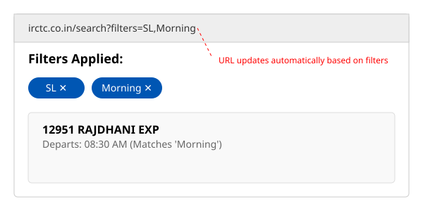
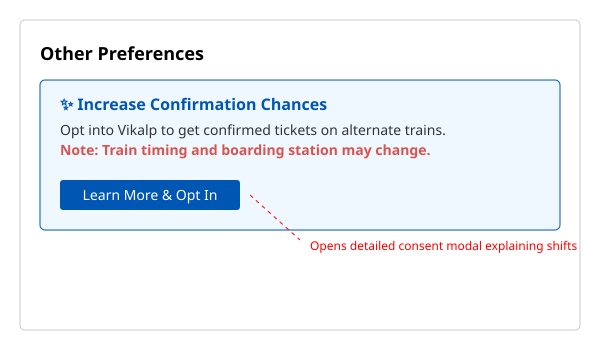

# Feature Specifications
 
## Feature Spec 1: Tatkal Booking Crashes at 10:00 AM
 
### Problem Statement
Server timeout and gateway errors occur exactly when Tatkal booking opens, preventing users from moving past the train list or payment gateway. Hundreds of thousands of users attempting last-minute emergency travel are left stranded with dropped connections and no queue position. The consequence is massive user frustration and unfair ticket distribution based on server lottery rather than first-come-first-serve.
 
### Current State (from Part A)
Currently, users select Tatkal and refresh precisely at 10:00 AM (Step 4). The system freezes with a loading spinner (Step 5), and eventually throws a generic "Service Unavailable" error (Step 7). The servers fail to handle the massive concurrent request spike, dropping connections abruptly.
 
### Proposed Solution
Implement a Virtual Waiting Room. Users who log in between 9:45 AM and 10:00 AM for Tatkal are placed in a pre-queue. At exactly 10:00 AM, they are assigned a random, fair queue position and placed in a waiting room. The UI clearly displays their queue number, estimated wait time, and a progress bar. The system lets users into the booking flow in controlled batches, eliminating server crashes.
 
### Proposed User Flow — Step by Step
1. User logs into IRCTC at 9:55 AM and selects Tatkal quota.
2. User is redirected to a "Virtual Waiting Room" screen.
3. At 10:00 AM, the screen dynamically updates to show: "You are #4,521 in line. Estimated wait: 4 minutes."
4. User watches the progress bar fill up as their number approaches.
5. User is automatically redirected to the train list page with a guaranteed 3-minute booking window.
6. User clicks "Book Now", enters details, and completes payment without server timeouts.
 
### Technical Implementation Plan
**System components affected:**
- Edge routing layer (Cloudflare / AWS CloudFront)
- Core booking gateway
- Frontend train selection UI
 
**New data requirements:**
- In-memory data store (Redis) to manage active tokens, queue positions, and timestamps.
 
**API changes:**
- New endpoint `GET /api/queue/status` for polling queue position.
- Modified booking endpoint to require a valid, active queue token.
 
**Frontend changes:**
- New `WaitingRoom` React/Angular component with polling logic and progress visualization.
- Redirection logic interceptors.
 
**Third-party services (if any):**
- Cloudflare Waiting Room API or AWS API Gateway usage plans to handle the edge-level queuing.
 
### Success Metrics
- 99.9% reduction in 503 Service Unavailable errors during 10:00 AM - 10:15 AM window.
- 100% of Tatkal tickets booked without user-facing server timeouts.
- Increase in Customer Satisfaction (CSAT) scores for Tatkal bookings.
 
### Edge Cases and Constraints
- **User drops connection:** Keep their queue position reserved for a 2-minute grace period if they disconnect.
- **IRCTC-specific constraints:** Massive scale (millions of concurrent connections) requires the queue to be handled at the CDN/Edge level, not the application server.
- **Graceful degradation:** If the queue system fails, fallback to a strict rate-limited direct access (current state but throttled to prevent total crash).

### Wireframe

*Caption: Proposed Tatkal virtual queue screen*
 
---

## Feature Spec 2: Search Filters Do Not Work Reliably
 
### Problem Statement
Applied filters (like specific class or departure time) reset unexpectedly when navigating back from a train detail view. Travel planners are forced to manually re-filter the results every time they check a train's route and go back, causing significant friction in the comparison process.
 
### Current State (from Part A)
When a user applies filters (Step 3) and clicks on a train (Step 5), navigating "Back" (Step 6) causes the search results to reload completely without the previously applied filters (Step 7). State management is fundamentally broken across navigation.
 
### Proposed Solution
Sync filter state with URL query parameters and persist it in local browser storage. When a user applies a filter, the URL updates instantly. If the user navigates away and clicks back, the page reads the URL parameters and immediately re-applies the filters, showing the exact state they left.
 
### Proposed User Flow — Step by Step
1. User searches for trains between New Delhi and Mumbai.
2. User applies "Sleeper (SL)" and "Morning" filters.
3. The URL visibly updates to include `?filters=SL,morning`.
4. User clicks on a train to check route details.
5. User clicks the browser "Back" button.
6. The search page loads, reads the URL, and instantly restores the "Sleeper" and "Morning" filters.
 
### Technical Implementation Plan
**System components affected:**
- Frontend routing module.
- Search Results component.
 
**New data requirements:**
- None (purely client-side state).
 
**API changes:**
- No new APIs. Existing search API should accept filter parameters directly on the initial load.
 
**Frontend changes:**
- Implement URL state syncing (e.g., using React Router).
- Update the filter sidebar component to initialize its state from URL search params.
 
**Third-party services (if any):**
- None.
 
### Success Metrics
- 100% filter retention rate upon backward navigation.
- 30% reduction in redundant search API calls.
- Decrease in average time to complete a booking for users who check multiple train details.
 
### Edge Cases and Constraints
- **Stale URLs:** If a user bookmarks the filtered URL and opens it weeks later, dates might be invalid. Add date validation to the URL parsing logic.
- **Graceful degradation:** If URL parsing fails, default to an unfiltered search state.

### Wireframe

*Caption: Proposed Filter URL persistence UI with active filter chips*
 
---

## Feature Spec 3: Seat Selection Resets
 
### Problem Statement
A user's berth preference (e.g., Lower Berth) selected during the passenger details step is not retained and resets without warning on the review page. This disproportionately affects elderly passengers and those with mobility issues who specifically require lower berths.
 
### Current State (from Part A)
A user selects "Lower" from the Berth Preference dropdown (Step 4) and clicks Proceed (Step 5). Upon reaching the Journey Review page (Step 6), the berth preference shows as "No Preference" or is blank (Step 7), silently ignoring the user's critical request.
 
### Proposed Solution
Overhaul the frontend form state management to ensure passenger array data (including berth preferences) is deeply cloned and passed correctly to the confirmation screen. Add a visual confirmation badge next to the passenger name on the review screen explicitly stating the requested berth.
 
### Proposed User Flow — Step by Step
1. User lands on Passenger Details page and enters their name.
2. User selects "Lower" from the Berth Preference dropdown.
3. User clicks "Proceed to Review".
4. The system validates that the selected preference exists for the given coach class.
5. User lands on Journey Review page.
6. A green highlight badge reads: "Preference: Lower Berth" next to the passenger's name.
 
### Technical Implementation Plan
**System components affected:**
- Passenger details form frontend component.
- Booking review frontend component.
- State management store (Redux/NgRx).
 
**New data requirements:**
- None, fields exist but mapping is broken.
 
**API changes:**
- Ensure the `POST /api/booking/review` payload strictly enforces the `berthPreference` enum instead of dropping it silently.
 
**Frontend changes:**
- Fix payload serialization logic to include berth preferences.
- Add UI badges for preferences on the review page.
 
**Third-party services (if any):**
- None.
 
### Success Metrics
- 0% drop-off rate of berth preferences between details and review pages.
- 50% reduction in customer support tickets regarding wrong seat allocation after booking.
- Increase in successful allocations of lower berths to senior citizens.
 
### Edge Cases and Constraints
- **Preference Unavailable:** If lower berth is definitively unavailable, show a warning *before* proceeding to review: "Lower berth not available. Continue with no preference?"
- **Graceful degradation:** The booking should succeed even if the preference is ignored, but the UI must inform the user.
 
---

## Feature Spec 4: CAPTCHA Loop on Login
 
### Problem Statement
The login CAPTCHA frequently rejects correct inputs or fails to load, trapping users in an infinite loop. This affects all users, particularly those with visual impairments or slow internet, delaying their access to crucial booking windows.
 
### Current State (from Part A)
User types the exact alphanumeric string shown (Step 4) and clicks Sign In (Step 5). The page reloads, displaying "Invalid CAPTCHA" (Step 6) and forcing the user to re-enter their password and try again (Step 7).
 
### Proposed Solution
Replace the legacy image-based CAPTCHA with an invisible behavioral analysis tool (like reCAPTCHA v3 or Cloudflare Turnstile). Users simply enter their username and password and click "Sign In". The system validates them silently based on browser signals. If flagged as suspicious, they get a user-friendly checkbox challenge.
 
### Proposed User Flow — Step by Step
1. User navigates to irctc.co.in and clicks "Login".
2. User enters username and password. No image CAPTCHA is displayed.
3. User clicks "Sign In".
4. System seamlessly verifies the session token via a Turnstile hidden widget.
5. User is successfully logged in and redirected to the dashboard immediately.
 
### Technical Implementation Plan
**System components affected:**
- Login frontend form.
- Authentication API middleware.
 
**New data requirements:**
- None.
 
**API changes:**
- Update `POST /api/auth/login` to accept a Turnstile token instead of an image CAPTCHA string.
- Remove CAPTCHA generation API endpoints.
 
**Frontend changes:**
- Remove the CAPTCHA image and input field from the UI.
- Integrate the Cloudflare Turnstile JS widget.
 
**Third-party services (if any):**
- Cloudflare Turnstile or Google reCAPTCHA Enterprise.
 
### Success Metrics
- 90% reduction in average login time.
- 99% decrease in "Invalid CAPTCHA" errors.
- Increased conversion rate for the first step of the funnel.
 
### Edge Cases and Constraints
- **Bot attacks:** If Turnstile fails to stop a sophisticated bot attack, fallback to a strict rate-limit and an interactive challenge.
- **Unsupported browsers:** Ensure the invisible token degrades gracefully to a traditional challenge for older browsers.
 
---

## Feature Spec 5: Vikalp Scheme UI is Confusing
 
### Problem Statement
The Vikalp option is presented as a simple checkbox with no contextual explanation. Waitlisted passengers accidentally opt-in, leading to unexpected train shifts and radically altered travel schedules without their full understanding.
 
### Current State (from Part A)
User scrolls to "Other Preferences" (Step 4) and sees a lone checkbox labeled "Opt for Vikalp" (Step 5). The user checks it blindly (Step 6) and later discovers their ticket was confirmed on a train 12 hours later than planned (Step 7).
 
### Proposed Solution
Replace the simple checkbox with a dedicated interactive card. When clicked, a modal clearly explains the Vikalp scheme with visual timelines, stating explicitly that train timings and boarding stations may change. The user must actively select acceptable time deviations (e.g., "+/- 12 hours") to opt in.
 
### Proposed User Flow — Step by Step
1. User fills in passenger information for a waitlisted ticket.
2. User sees a distinct card: "Increase Confirmation Chances with Vikalp (Alternate Trains)".
3. User clicks "Learn More & Opt In".
4. A modal appears explaining: "Your train might change. You may depart up to 12 hours early or late."
5. User checks an explicit consent box: "I agree to travel on alternate trains."
6. User clicks "Save Preference" and completes the booking.
 
### Technical Implementation Plan
**System components affected:**
- Passenger details form UI.
 
**New data requirements:**
- Save the user's accepted time deviation window (if the backend supports it) or just the consent flag.
 
**API changes:**
- No changes required, just better frontend framing of the existing boolean payload.
 
**Frontend changes:**
- Remove the raw checkbox.
- Build the "Vikalp Info Modal" component with clear typography and illustrations.
 
**Third-party services (if any):**
- None.
 
### Success Metrics
- 80% reduction in user complaints/tweets regarding "IRCTC changed my train without asking".
- Higher *intentional* opt-in rates for Vikalp as users actually understand its value.
 
### Edge Cases and Constraints
- **Mobile responsiveness:** The explanatory modal must be easily readable and tappable on small screens.
- **Graceful degradation:** If the modal fails to load, do not allow Vikalp opt-in to prevent non-consensual modifications.

### Wireframe

*Caption: Proposed Vikalp educational card and consent modal*
 
---

## Feature Spec 6: Session Expiry Erases All Entered Data
 
### Problem Statement
If a session expires while a user is filling out a long passenger details form, the user is abruptly redirected to the login page, and all entered data is irreversibly lost. This punishes users booking for large groups who require more time.
 
### Current State (from Part A)
User takes 10 minutes to enter 6 passengers (Step 2). The session expires invisibly (Step 3). The user clicks Continue (Step 4) and is redirected to the login page (Step 5). All passenger data is lost, forcing them to restart (Step 7).
 
### Proposed Solution
Implement local browser caching for the passenger details form. Additionally, display a non-intrusive sticky banner 2 minutes before session expiry warning the user, with a "Keep me logged in" button that silently pings the server to refresh the session token.
 
### Proposed User Flow — Step by Step
1. User initiates a booking and takes 8 minutes to enter data.
2. At 8 minutes, a yellow banner drops down: "Session expires in 2:00. [Extend Session]".
3. User clicks "Extend Session". The timer resets to 10 minutes.
4. If the user misses the banner and gets logged out, they log back in.
5. They return to the passenger details page.
6. A prompt asks: "Restore previous passenger details?"
7. User clicks "Yes", and the form instantly populates from local storage.
 
### Technical Implementation Plan
**System components affected:**
- Global session manager frontend component.
- Passenger form state manager.
 
**New data requirements:**
- `localStorage` object for draft passenger arrays.
 
**API changes:**
- New endpoint `POST /api/auth/refresh` to extend the JWT/session cookie without requiring credentials.
 
**Frontend changes:**
- Implement an idle timer hook tied to JWT expiration.
- Build the Session Expiry Warning Toast component.
- Implement auto-save to `localStorage` on form field blur.
 
**Third-party services (if any):**
- None.
 
### Success Metrics
- 95% reduction in data loss incidents due to timeouts.
- High interaction rate with the "Extend Session" button.
- Decrease in drop-offs at the passenger details stage for 4+ passenger bookings.
 
### Edge Cases and Constraints
- **Shared computers:** Ensure `localStorage` drafts are cleared upon explicit user logout or successful booking to prevent leaking PII on cybercafe computers.
- **Graceful degradation:** If `localStorage` is disabled, the warning banner still provides a layer of protection.
